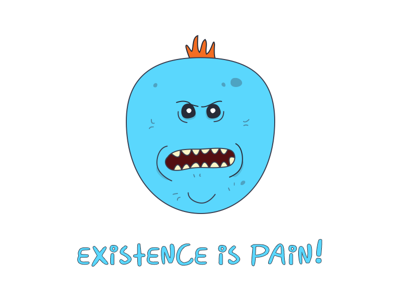

[](https://travis-ci.com/coup-mobility/meeseeks) [](https://codeclimate.com/github/coup-mobility/meeseeks/maintainability)


> Meeseeks are creatures who are created to serve a singular purpose for which they will go to any length to fulfill. After they serve their purpose, they expire and vanish into the air. [[1](http://rickandmorty.wikia.com/wiki/Mr._Meeseeks)]

# Meeseeks

## Usage

Asynchronously submit metrics to a Circonus HTTPTrap:

```ruby
> m = Meeseeks::Meeseeks.new(
  data_submission_url: 'https://api.circonus.com/module/httptrap/2ds89as2-29e3-4155-a54a-4b7261419e11/secret',
  interval: 60,
  max_batch_size: 100
)
=> <
>  m.record('group', 'metric', 22.02)
=> true
```

### Meeseeks statistics

Meeseeks will instrument itself on Circonus. Look for these metrics:

- ``meeseeks`batch_size`` (how many measurements were submitted per request to Circonus?)
- ``meeseeks`cycle_count`` (how many intervals did this meeseeks instance do?)
- ``meeseeks`queue_size`` (how many measurements are waiting in the queue to be submitted?)
- ``meeseeks`request_count`` (how many requests to Circonus did this meeseeks instance do?)

## Development

After checking out the repo, run `make build` - you need only docker on your machine, no ruby, rvm, or any of that.

### Run the tests

During development, you can just keep `make guard` running and it will test files as you edit them. You can also run `make test` to run all of the tests.

### Automatically fix rubocop offenses

Run `make rubocop`.

## Contributing

Bug reports and pull requests are welcome on GitHub at https://github.com/jayniz/meeseeks. This project is intended to be a safe, welcoming space for collaboration, and contributors are expected to adhere to the [Contributor Covenant](http://contributor-covenant.org) code of conduct.

## Code of Conduct

Everyone interacting in the Meeseeks project’s codebases, issue trackers, chat rooms and mailing lists is expected to follow the [code of conduct](https://github.com/jayniz/meeseeks/blob/master/CODE_OF_CONDUCT.md).


## Acknowledgements

Mr. Meeseeks by [Nathan Andrews](https://dribbble.com/shots/2846308-Mr-Meeseeks?utm_source=Clipboard_Shot&utm_campaign=nathanandrews&utm_content=Mr%20Meeseeks&utm_medium=Social_Share)
